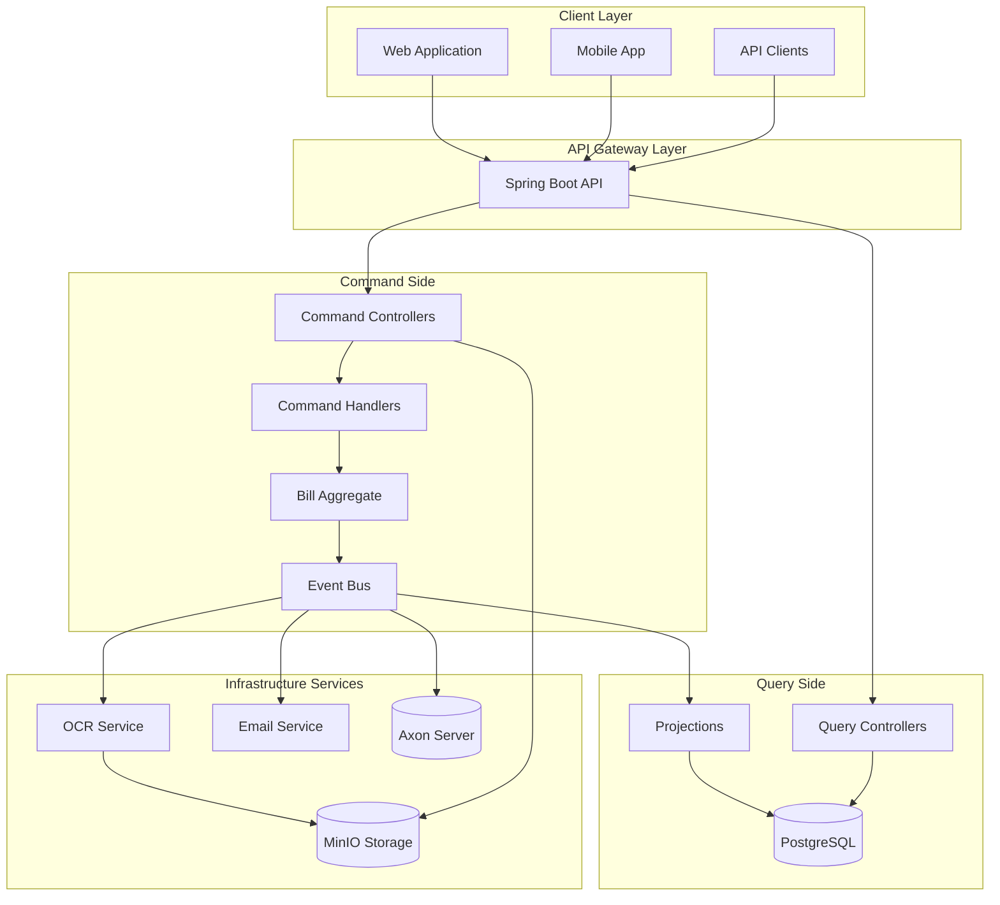
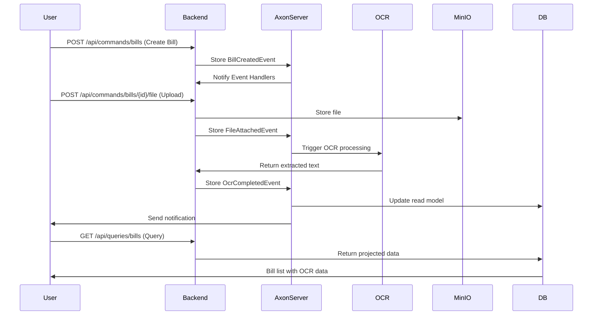

# 🧾 Billing & Expense Processing Service


A comprehensive **CQRS and Event Sourcing** powered billing system that automates invoice processing, OCR extraction, and approval workflows. Built with **Spring Boot**, **Axon Framework**, and modern microservices architecture.

## 🎯 Overview

This service solves the common business challenge of managing bills and expenses across organizations by providing:

- **Automated OCR Processing** - Extract text and structured data from invoice images
- **Event-Driven Architecture** - Complete audit trail with CQRS and Event Sourcing
- **File Management** - Secure storage with MinIO S3-compatible object storage
- **Approval Workflows** - Multi-step bill approval process with notifications
- **RESTful APIs** - Clean separation of commands and queries
- **Scalable Design** - Microservices architecture ready for production

## 🏗️ Architecture



## 🛠️ Technology Stack

| Component | Technology | Version | Purpose |
|-----------|------------|---------|---------|
| **Backend Framework** | Spring Boot | 3.2.0 | Main application framework |
| **CQRS/ES** | Axon Framework | 4.8.0 | Command handling and event sourcing |
| **Event Store** | Axon Server | 4.6.3 | Event storage and routing |
| **Database** | PostgreSQL | 15 | Query-side read models |
| **Object Storage** | MinIO | Latest | S3-compatible file storage |
| **OCR Service** | FastAPI + Tesseract | 5.3.0 | Text extraction from images |
| **Email** | Spring Mail + MailHog | 1.0.1 | SMTP testing and notifications |
| **Containerization** | Docker Compose | 3.8 | Service orchestration |
| **JVM** | OpenJDK | 21 | Runtime environment |

## 🚀 Quick Start

Get the entire billing system running in under 5 minutes:

### Prerequisites

- [Docker](https://docs.docker.com/get-docker/) and [Docker Compose](https://docs.docker.com/compose/install/) installed
- Git for cloning the repository
- At least 4GB RAM available

### 1. Clone and Start

```bash
# Clone the repository
git clone <repository-url>
cd billing-backend

# Start all services
docker compose up -d

# Wait for services to initialize (30-60 seconds)
docker compose logs -f backend
```

### 2. Verify Setup

```bash
# Check system health
curl http://localhost:8080/actuator/health

# Expected response: {"status":"UP"}
```

### 3. Create Your First Bill

```bash
# Create a new bill
curl -X POST http://localhost:8080/api/commands/bills \
  -H "Content-Type: application/json" \
  -d '{
    "title": "Office Supplies Invoice",
    "total": 150.75,
    "vendor": "Staples",
    "dueDate": "2024-12-15"
  }'

# Expected response: Bill ID and creation confirmation
```

### 4. Explore the System

- **API Documentation**: http://localhost:8080/swagger-ui.html
- **Axon Dashboard**: http://localhost:8024
- **MinIO Console**: http://localhost:9001 (minioadmin/minioadmin)
- **Mail Testing**: http://localhost:8025
- **OCR Service**: http://localhost:7070/docs

## 📚 API Documentation

### Core Endpoints

#### Commands (Write Operations)
```bash
# Create bill
POST /api/commands/bills
Content-Type: application/json

{
  "title": "Electric Bill",
  "total": 89.99,
  "vendor": "Con Edison",
  "dueDate": "2024-12-01"
}
```

```bash
# Attach file to bill
POST /api/commands/bills/{billId}/file
Content-Type: multipart/form-data

file: [binary image data]
```

```bash
# Approve bill
POST /api/commands/bills/{billId}/approve
Content-Type: application/json

{
  "approvedBy": "john.doe@company.com",
  "comments": "Approved for payment"
}
```

#### Queries (Read Operations)
```bash
# List all bills
GET /api/queries/bills?page=0&size=20&sort=createdAt,desc

# Get bill details
GET /api/queries/bills/{billId}

# Search bills
GET /api/queries/bills/search?title=electric&status=PENDING
```

#### Storage Operations
```bash
# Get upload URL
POST /api/storage/upload-url
Content-Type: application/json

{
  "fileName": "invoice.pdf",
  "contentType": "application/pdf"
}
```

### Interactive Documentation

Visit **http://localhost:8080/swagger-ui.html** for interactive API documentation with:
- Live endpoint testing
- Request/response schemas
- Authentication examples
- Error code documentation

### OCR Service (FastAPI)

- **Interactive Docs**: http://localhost:7070/docs
- **ReDoc**: http://localhost:7070/redoc

#### Key Endpoints

- `POST /ocr` - Extract text from uploaded file
- `POST /ocr/structured` - Extract structured data from bill

## 🏛️ CQRS + Event Sourcing Flow



## 🛠️ Development Guide

### Local Development Setup

#### Prerequisites
- Java 21+ installed
- Maven 3.8+
- Docker and Docker Compose
- IDE (IntelliJ IDEA recommended)

#### Backend Development

```bash
# 1. Start infrastructure services
docker compose up -d postgres axonserver minio mailhog

# 2. Start OCR service
docker compose up -d ocr

# 3. Run backend locally
cd backend
mvn spring-boot:run

# 4. Run tests
mvn test

# 5. Build application
mvn clean package
```

#### Project Structure

```
billing-backend/
├── backend/
│   ├── src/main/java/com/acme/billing/
│   │   ├── api/                    # Command/Query DTOs
│   │   │   ├── commands/          # Command objects
│   │   │   ├── queries/           # Query objects
│   │   │   └── events/            # Domain events
│   │   ├── domain/                # Aggregates and business logic
│   │   │   ├── BillAggregate.java
│   │   │   └── BillStatus.java
│   │   ├── projection/            # Query-side projections
│   │   │   ├── BillProjection.java
│   │   │   └── BillSummary.java
│   │   ├── service/               # Business services
│   │   │   ├── OcrService.java
│   │   │   └── StorageService.java
│   │   ├── web/                   # REST controllers
│   │   │   ├── BillCommandController.java
│   │   │   ├── BillQueryController.java
│   │   │   └── StorageController.java
│   │   └── config/                # Configuration classes
│   └── src/test/                  # Test suites
├── ocr-service/                   # FastAPI OCR microservice
├── docs/                         # Documentation
├── api/                          # API examples and collections
└── docker-compose.yml           # Service orchestration
```

### Testing

#### Running Tests

```bash
# Unit tests
mvn test

# Integration tests
mvn verify -P integration-tests

# Test coverage
mvn jacoco:report
open target/site/jacoco/index.html
```

#### Test Structure

```bash
backend/src/test/java/
├── unit/                         # Unit tests
│   ├── commands/                 # Command handling tests
│   ├── domain/                   # Domain logic tests
│   └── service/                  # Service layer tests
├── integration/                  # Integration tests
│   ├── api/                      # API endpoint tests
│   ├── database/                 # Database tests
│   └── infrastructure/           # Infrastructure tests
└── e2e/                         # End-to-end tests
```

### Code Quality

```bash
# Code formatting
mvn spring-javaformat:apply

# Static analysis
mvn sonar:sonar

# Dependency updates
mvn versions:display-dependency-updates
```

## 🚀 Deployment

### Production Deployment

#### Environment Configuration

```bash
# Production environment variables
export SPRING_PROFILES_ACTIVE=prod
export DATABASE_URL=jdbc://prod-db:5432/billing
export AXON_SERVER_ENDPOINTS=prod-axon:8124
export MINIO_ENDPOINT=https://prod-minio.company.com
export OCR_SERVICE_URL=https://prod-ocr.company.com
```

#### Docker Production Deployment

```bash
# Build production images
docker compose -f docker-compose.prod.yml build

# Deploy with production configurations
docker compose -f docker-compose.prod.yml up -d

# Health check
curl https://billing.company.com/actuator/health
```

#### Kubernetes Deployment

```bash
# Apply Kubernetes manifests
kubectl apply -f k8s/

# Check deployment status
kubectl get pods -n billing

# Scale services
kubectl scale deployment billing-backend --replicas=3 -n billing
```

### Monitoring and Observability

#### Health Endpoints

```bash
# Application health
GET /actuator/health

# Detailed health info
GET /actuator/health/details

# Metrics
GET /actuator/metrics

# Info
GET /actuator/info
```

#### Logging

```bash
# View application logs
docker compose logs -f backend

# Structured logging (JSON format)
export LOGGING_STRUCTURED_JSON=true
```

## 🔧 Configuration

### Application Properties

Key configuration options in `application.yml`:

```yaml
# Database Configuration
spring:
  datasource:
    url: jdbc:postgresql://localhost:5432/billing_db
    username: billing_user
    password: billing_password

  # Axon Configuration
axon:
  axonserver:
    servers: localhost:8124

# MinIO Configuration
minio:
  endpoint: http://localhost:9000
  access-key: minioadmin
  secret-key: minioadmin
  bucket-name: bills

# OCR Service
ocr:
  service-url: http://localhost:7070
  timeout: 30s
  retry-attempts: 3
```

### Environment-Specific Configs

- `application-dev.yml` - Development settings
- `application-docker.yml` - Docker environment
- `application-prod.yml` - Production configuration

## 🔍 Troubleshooting

### Common Issues

#### 1. Services Won't Start

**Problem**: Services fail to start with connection errors

**Solution**:
```bash
# Check if all services are running
docker compose ps

# Restart services in correct order
docker compose down
docker compose up -d postgres axonserver
# Wait 30 seconds
docker compose up -d minio mailhog
# Wait 20 seconds
docker compose up -d ocr backend
```

#### 2. OCR Processing Fails

**Problem**: OCR service returns errors or timeouts

**Solution**:
```bash
# Check OCR service health
curl http://localhost:7070/health

# Verify Tesseract installation
docker exec billing-ocr tesseract --version

# Check file size limits
grep MAX_FILE_SIZE docker-compose.yml
```

#### 3. File Upload Issues

**Problem**: Cannot upload files to MinIO

**Solution**:
```bash
# Verify MinIO is accessible
curl http://localhost:9000/minio/health/live

# Check bucket exists
docker exec billing-minio mc ls local/bills

# Create bucket if missing
docker exec billing-minio mc mb local/bills
```

#### 4. Database Connection Errors

**Problem**: Backend cannot connect to PostgreSQL

**Solution**:
```bash
# Test database connection
docker exec billing-postgres psql -U billing_user -d billing_db -c "SELECT 1;"

# Check database logs
docker compose logs postgres

# Reset database if needed
docker compose down
docker volume rm billing_postgres_data
docker compose up -d postgres
```

#### 5. Axon Server Connection Issues

**Problem**: Events are not being stored or retrieved

**Solution**:
```bash
# Check Axon Server health
curl http://localhost:8024/v1/public/context

# Verify Axon Server logs
docker compose logs axonserver

# Clear Axon Server data if corrupted
docker compose down
docker volume rm billing_axon_data billing_axon_events
docker compose up -d axonserver
```

### Performance Issues

#### Memory Usage

```bash
# Monitor container memory usage
docker stats

# Increase JVM memory if needed
export JAVA_OPTS="-Xmx2g -Xms1g"
```

#### Database Performance

```bash
# Check database connections
docker exec billing-postgres psql -U billing_user -d billing_db -c "SELECT count(*) FROM pg_stat_activity;"

# Add database indexes for slow queries
-- Example: Add index on bill status
CREATE INDEX idx_bill_status ON bill_summary(status);
```

## 🤝 Contributing

### Development Workflow

1. **Fork** the repository
2. **Create** a feature branch: `git checkout -b feature/new-feature`
3. **Make** your changes with comprehensive tests
4. **Run** all tests: `mvn clean verify`
5. **Format** code: `mvn spring-javaformat:apply`
6. **Commit** with clear messages
7. **Push** to your fork
8. **Create** a Pull Request

### Code Standards

- **Java**: Follow Google Java Style Guide
- **Documentation**: Javadoc for all public APIs
- **Tests**: Minimum 80% code coverage
- **Commits**: Conventional Commit messages
- **Branches**: feature/, bugfix/, hotfix/ prefixes

### Pull Request Guidelines

- Include description of changes
- Add tests for new functionality
- Update documentation if needed
- Ensure CI/CD pipeline passes
- Request code review from team members

## 📄 License

This project is licensed under the MIT License - see the [LICENSE](LICENSE) file for details.

## 🙋‍♂️ Support

### Getting Help

- **Documentation**: Check this README and `/docs` directory
- **API Documentation**: http://localhost:8080/swagger-ui.html
- **Issues**: Create GitHub issues for bugs and feature requests
- **Discussions**: Use GitHub Discussions for questions

### Community

- **Contributing**: See [Contributing Guidelines](CONTRIBUTING.md)
- **Code of Conduct**: See [Code of Conduct](CODE_OF_CONDUCT.md)
- **Security**: Report security issues privately

---

## 🔗 Quick Links

| Service | URL | Credentials |
|---------|-----|-------------|
| **Backend API** | http://localhost:8080 | - |
| **Swagger UI** | http://localhost:8080/swagger-ui.html | - |
| **Axon Dashboard** | http://localhost:8024 | - |
| **MinIO Console** | http://localhost:9001 | minioadmin/minioadmin |
| **Mail Testing** | http://localhost:8025 | - |
| **OCR Service** | http://localhost:7070/docs | - |

---

**Built with ❤️ using Spring Boot and Axon Framework**