# Architecture Documentation

## Overview

The Billing & Expense Processing Service is built using **CQRS (Command Query Responsibility Segregation)** and **Event Sourcing** patterns with the **Axon Framework**. This architecture provides excellent scalability, auditability, and maintainability for complex business domains.

## Core Architectural Patterns

### CQRS (Command Query Responsibility Segregation)

CQRS separates the read and write operations of a data store into different models:

- **Command Side**: Handles write operations (commands) and emits events
- **Query Side**: Handles read operations (queries) from optimized read models

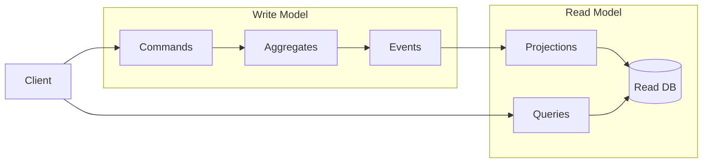

### Event Sourcing

Instead of storing the current state of entities, we store the sequence of events that led to that state:

- **Immutable Events**: All state changes are captured as immutable events
- **Event Store**: Events are stored in a time-ordered sequence
- **State Rebuilding**: Current state can be rebuilt by replaying events
- **Complete Audit Trail**: Every change is preserved with full context

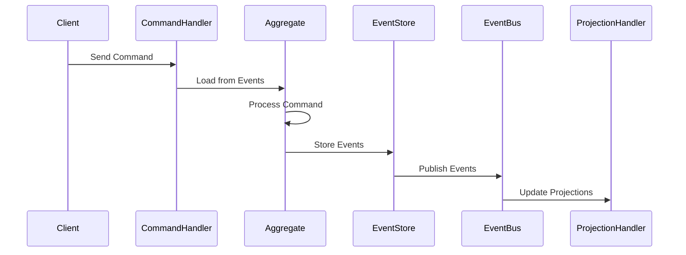

## System Architecture

### High-Level Architecture

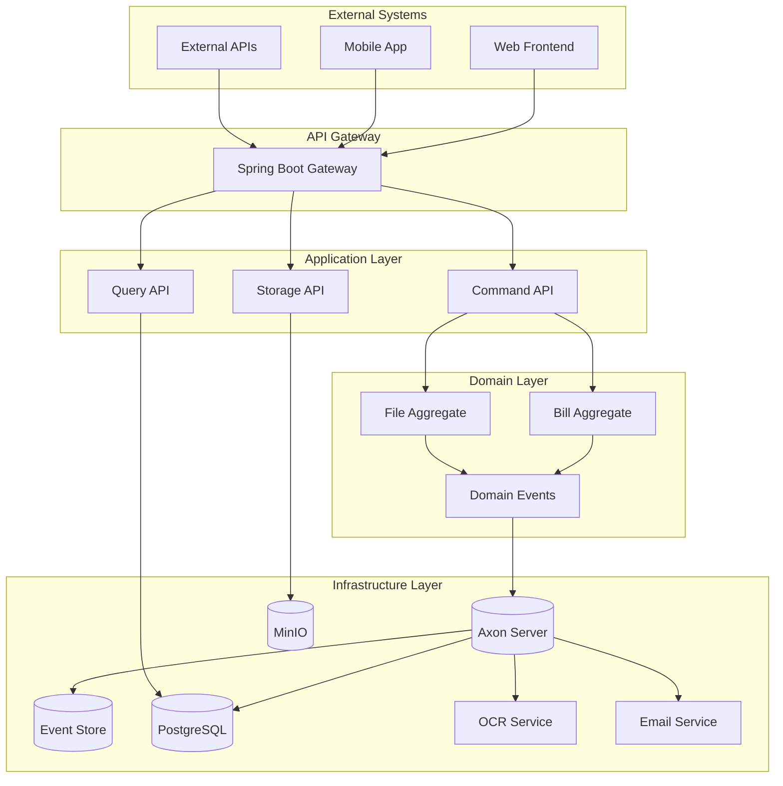

### Service Interactions

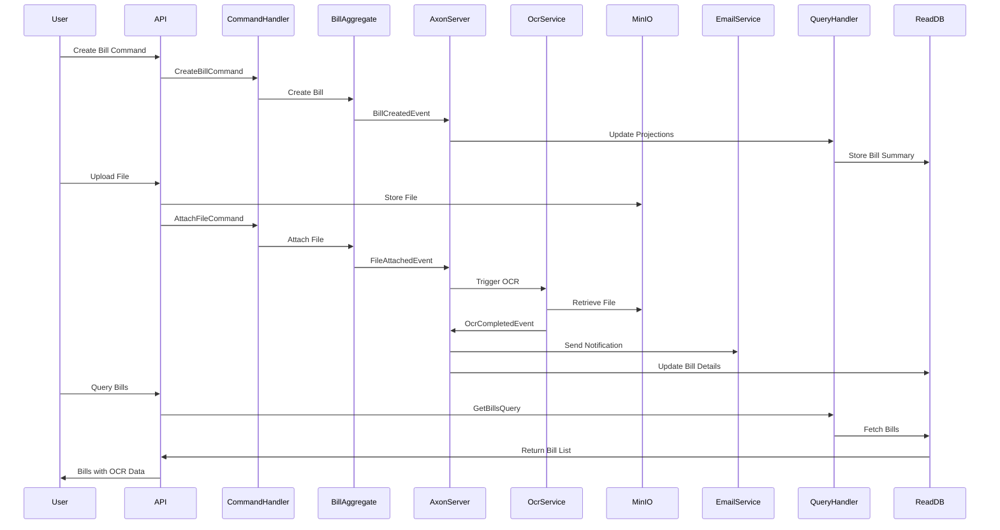

## Domain Model

### Bill Aggregate

The **Bill Aggregate** is the core domain entity that manages bill lifecycle:

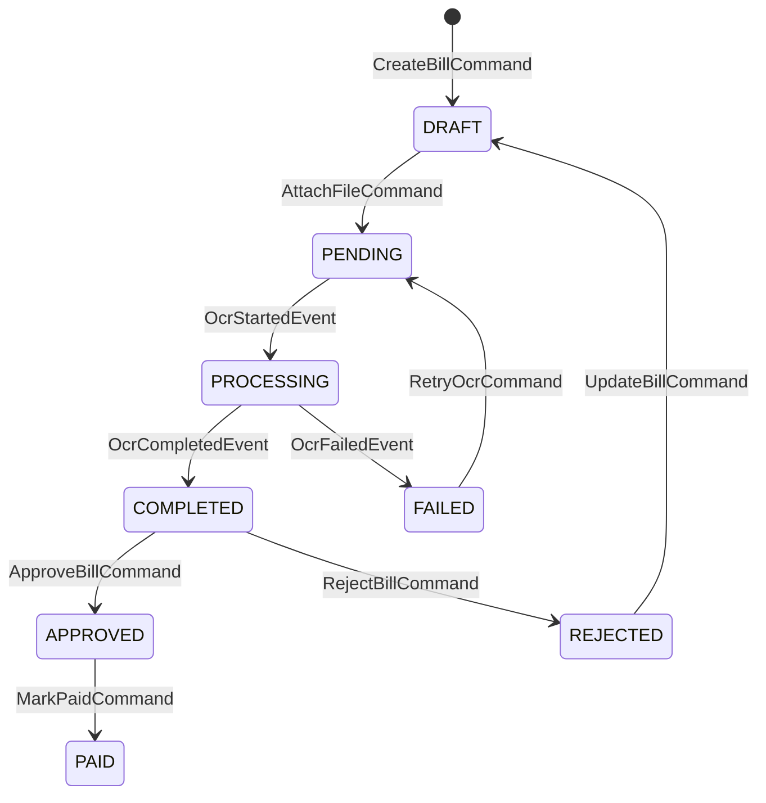

### Events

The system emits the following domain events:

- **BillCreatedEvent**: New bill created
- **BillUpdatedEvent**: Bill information updated
- **FileAttachedEvent**: File attached to bill
- **OcrStartedEvent**: OCR processing initiated
- **OcrCompletedEvent**: OCR processing completed successfully
- **OcrFailedEvent**: OCR processing failed
- **BillApprovedEvent**: Bill approved
- **BillRejectedEvent**: Bill rejected
- **BillDeletedEvent**: Bill deleted

### Commands

- **CreateBillCommand**: Create a new bill
- **UpdateBillCommand**: Update bill information
- **AttachFileCommand**: Attach file to bill
- **ApplyOcrResultCommand**: Apply OCR processing results
- **ApproveBillCommand**: Approve bill for payment
- **RejectBillCommand**: Reject bill
- **DeleteBillCommand**: Delete bill

## Data Flow

### Command Processing Flow

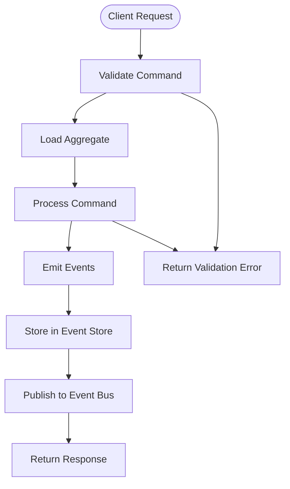

### Query Processing Flow

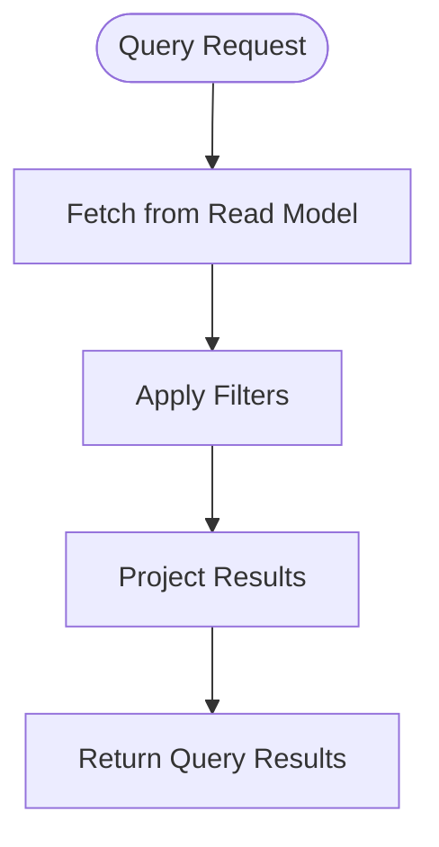

### Event Processing Flow

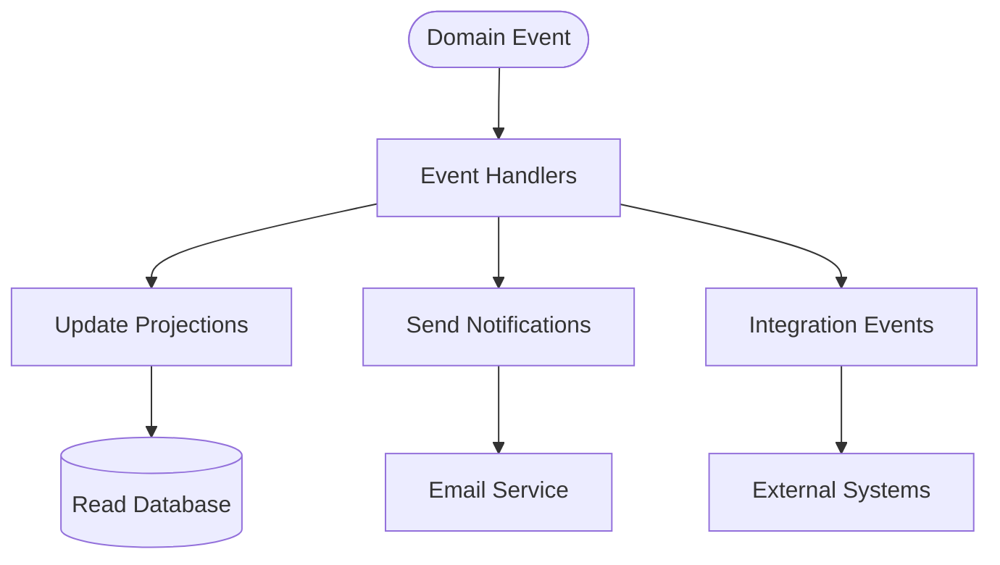

## Infrastructure Components

### Axon Server

**Axon Server** serves as the central nervous system:

- **Event Store**: Immutable storage of all domain events
- **Command Bus**: Routes commands to appropriate handlers
- **Event Bus**: Distributes events to all subscribers
- **Query Bus**: Routes queries to query handlers

### PostgreSQL (Read Model)

Optimized for fast queries with:

- **Denormalized Data**: Pre-joined and optimized for read operations
- **Indexes**: Strategic indexes for common query patterns
- **Materialized Views**: Complex queries pre-computed for performance

### MinIO Object Storage

S3-compatible file storage for:

- **Bill Files**: Original uploaded documents
- **Processed Files**: Enhanced/processed versions
- **Temporary Files**: Files during processing

### OCR Service

Microservice for text extraction:

- **FastAPI**: Modern Python web framework
- **Tesseract**: Open-source OCR engine
- **Async Processing**: Non-blocking file processing
- **Error Handling**: Comprehensive error management

## Scalability Patterns

### Horizontal Scaling

- **Command Processing**: Scale command handlers independently
- **Query Processing**: Scale read models based on query load
- **Event Processing**: Parallel event handler processing
- **OCR Processing**: Scale OCR service based on file volume

### Event Sourcing Benefits

- **Event Replay**: Rebuild projections from scratch
- **Temporal Queries**: Query system state at any point in time
- **Debugging**: Replay events to debug issues
- **Audit Trail**: Complete history of all changes

### CQRS Benefits

- **Optimized Models**: Separate models for commands and queries
- **Performance**: Read models optimized for specific queries
- **Scalability**: Scale read and write independently
- **Flexibility**: Evolve read models without affecting writes

## Security Architecture

### Authentication & Authorization

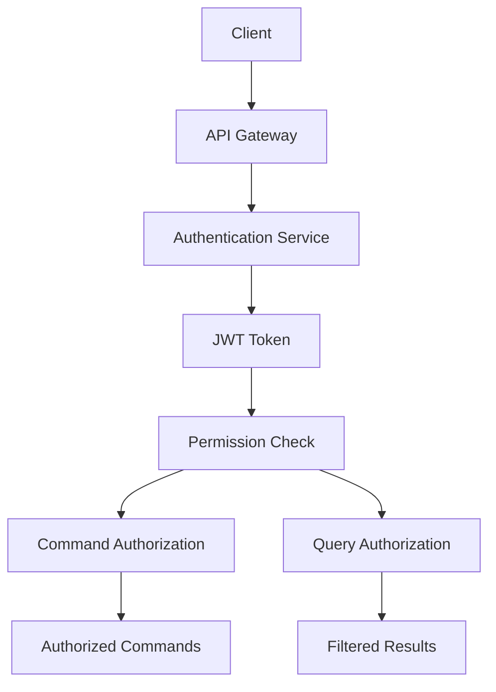

### Data Protection

- **Encryption**: Data encrypted at rest and in transit
- **Access Control**: Role-based access to commands and queries
- **Audit Logging**: All actions logged with user context
- **Data Isolation**: Multi-tenant data separation

## Monitoring & Observability

### Metrics Collection

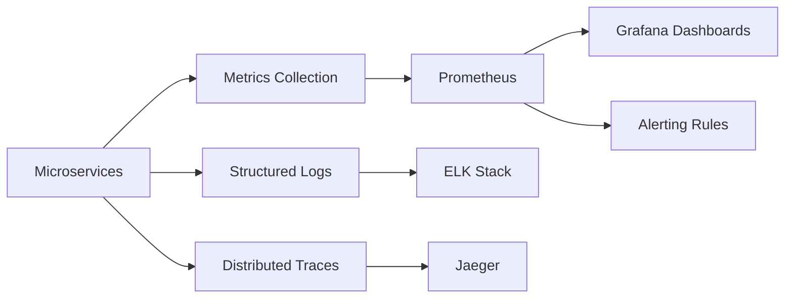

### Health Monitoring

- **Service Health**: Individual service health checks
- **Dependency Health**: External service availability
- **Database Health**: Database connectivity and performance
- **Event Store Health**: Axon Server status

### Performance Monitoring

- **Command Latency**: Time to process commands
- **Query Performance**: Database query performance
- **Event Processing**: Event handler throughput
- **Resource Usage**: Memory, CPU, and network usage

## Deployment Architecture

### Container Strategy

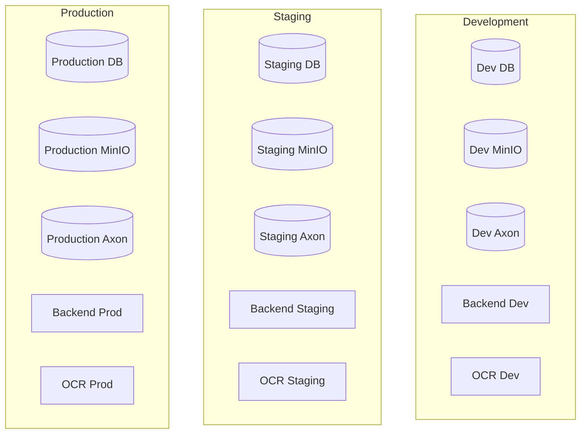

### Kubernetes Deployment

- **Pods**: Individual service instances
- **Services**: Service discovery and load balancing
- **ConfigMaps**: Configuration management
- **Secrets**: Sensitive data management
- **PersistentVolumes**: Durable storage

### CI/CD Pipeline

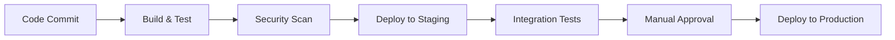

## Architecture Decision Records

### ADR-001: Use CQRS with Event Sourcing

**Decision**: Implement CQRS with Event Sourcing using Axon Framework

**Rationale**:
- Complex business domain with evolving requirements
- Need for complete audit trail
- Scalability requirements for read/write operations
- Business rules require event-driven processing

**Alternatives Considered**:
- Traditional CRUD with relational database
- Event-driven architecture without event sourcing
- Microservices with shared database

### ADR-002: Separate OCR Service

**Decision**: Extract OCR functionality into separate microservice

**Rationale**:
- Different technology stack (Python vs Java)
- Independent scaling requirements
- Potential for multiple OCR engines
- Clear bounded context

### ADR-003: Use MinIO for Object Storage

**Decision**: Use MinIO instead of cloud storage

**Rationale**:
- S3-compatible API for future migration
- Self-hosted for data control
- Docker-native deployment
- Cost-effective for development/staging

## Future Architecture Evolution

### Event-Driven Architecture

- **Event Streaming**: Use Kafka for high-volume events
- **Event Mesh**: Service mesh for event routing
- **Event Catalog**: Centralized event documentation

### Microservices Evolution

- **Bounded Contexts**: Further domain decomposition
- **API Gateway**: Enhanced gateway functionality
- **Service Discovery**: Dynamic service registration

### Data Architecture

- **Read Model Optimization**: Multiple specialized read models
- **Caching Strategy**: Multi-level caching
- **Data Lake**: Historical data analysis

### Integration Patterns

- **Message Brokers**: Advanced message routing
- **API Composition**: GraphQL for flexible queries
- **Webhooks**: Real-time event notifications