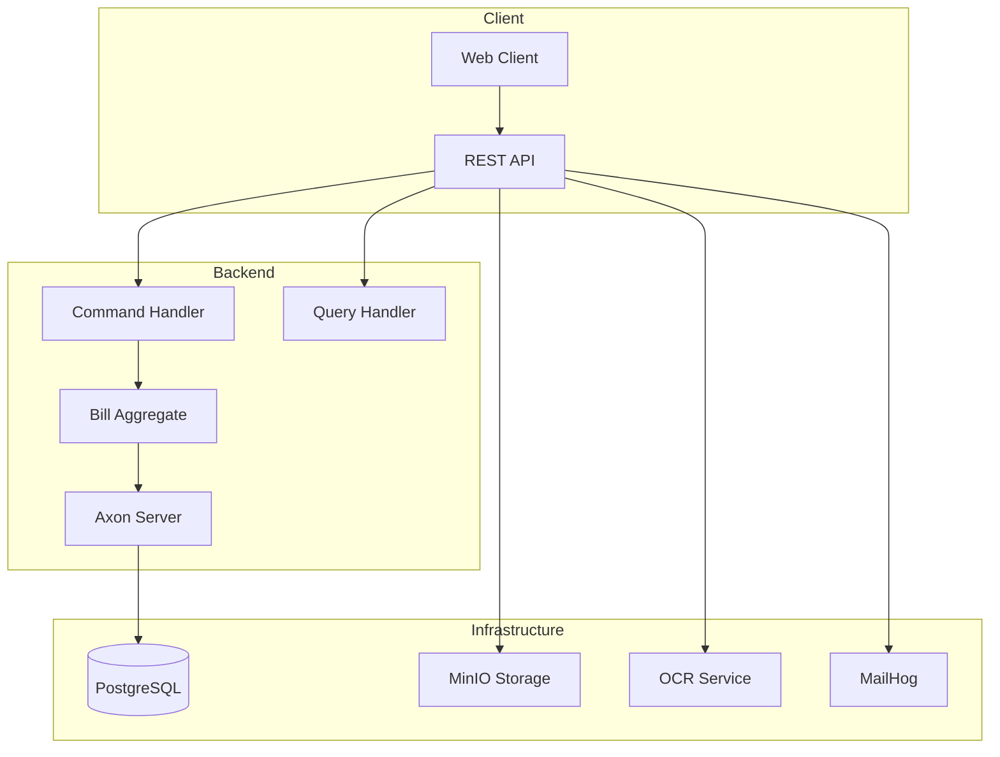

# Create Comprehensive README and Documentation

## Problem Statement
Create detailed README.md and API documentation covering setup, architecture, usage examples, and development guidelines. This ensures developers can understand, set up, and contribute to the billing system effectively.

## Findings
- No setup instructions for development environment
- Architecture decisions not documented
- API usage examples missing
- Onboarding new developers difficult
- Project understanding requires reading code
- Location: `README.md` (project root - to be created)

## Proposed Solutions

### Option 1: Create comprehensive documentation suite
- **Pros**: Enables easy onboarding, documents architecture decisions, provides clear usage examples
- **Cons**: Requires significant writing effort and maintenance
- **Effort**: Medium (3-4 hours)
- **Risk**: Low (Documentation always valuable)

## Recommended Action
[Leave blank - will be filled during approval]

## Technical Details
- **Affected Files**:
  - `README.md` (project root)
  - `docs/` directory for additional documentation
  - `api/` directory for Postman collections and examples
- **Related Components**: All system components
- **Database Changes**: No

## Documentation Structure:

### README.md Contents:
1. **Project Header**: Logo, brief description, technology badges
2. **Overview**: Business problem and solution approach
3. **Architecture**: CQRS pattern, microservices diagram
4. **Technology Stack**: Detailed component breakdown
5. **Quick Start**: 5-minute setup with Docker Compose
6. **API Documentation**: Links to OpenAPI, usage examples
7. **Development Guide**: Local setup, testing, contributing
8. **Deployment**: Production considerations
9. **Troubleshooting**: Common issues and solutions

### Additional Documentation:
- **docs/architecture.md**: Deep dive into CQRS and Event Sourcing
- **docs/development.md**: Detailed development workflow
- **docs/api-guide.md**: Comprehensive API usage guide
- **docs/deployment.md**: Production deployment instructions

### API Examples:
- **api/postman-collection.json**: Complete API collection
- **api/curl-examples.sh**: CLI usage examples
- **api/sample-requests/**: Sample request/response files

## Quick Start Content:
```bash
# Clone and start
git clone <repository>
cd billing-backend
docker compose up -d

# Wait for services to start (30 seconds)
curl http://localhost:8080/actuator/health

# Create first bill
curl -X POST http://localhost:8080/api/commands/bills \
  -H "Content-Type: application/json" \
  -d '{"title":"Sample Bill","total":100.00}'

# View API documentation
open http://localhost:8080/swagger-ui.html
```

## Architecture Diagram:


## Resources
- Original finding: GitHub issue triage
- Related issues: #002 (Docker Compose), #007 (REST Controllers)
- Mermaid Diagram Documentation: https://mermaid.js.org/
- OpenAPI Documentation: https://springdoc.org/
- GitHub README Best Practices: https://github.com/matiassingers/awesome-readme

## Acceptance Criteria
- [ ] Comprehensive README.md created with all sections
- [ ] Architecture diagrams and explanations
- [ ] Quick start guide with working Docker Compose setup
- [ ] API usage examples with curl and Postman collection
- [ ] Development environment setup instructions
- [ ] Testing guidelines and coverage expectations
- [ ] Deployment considerations and production setup
- [ ] Troubleshooting guide with common issues
- [ ] Technology stack details and version information
- [ ] Contributing guidelines and code standards

## Documentation Quality Metrics:
- **Setup Time**: < 5 minutes for new developers
- **Clarity**: All architectural decisions explained
- **Completeness**: Every endpoint documented with examples
- **Maintenance**: Documentation stays in sync with code changes

## Work Log

### 2025-01-22 - Initial Discovery
**By:** Claude Triage System
**Actions:**
- Issue discovered during GitHub issue triage
- Categorized as P2 (IMPORTANT)
- Estimated effort: Medium (3-4 hours)

**Learnings:**
- Good documentation is critical for project adoption and contribution
- Architecture diagrams help developers understand complex CQRS patterns
- Quick start guide reduces onboarding friction significantly
- API examples enable immediate system exploration

## Notes
Source: Triage session on 2025-01-22
Dependencies: Should be created after #002 (Docker Compose) and #007 (REST Controllers) are functional